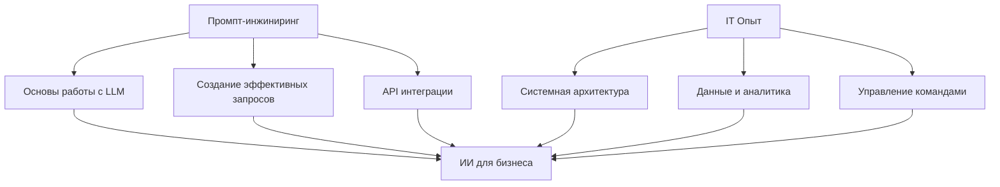

# 👋 Привет, меня зовут Сергей

## 🧠 Начинающий Промпт-инженер и специалист по внедрению ИИ

🎯 **36+ лет в IT** | 📈 **Изучаю AI-технологии** | 🎓 **Курс промпт-инжиниринга (в процессе)**

### 🚀 О себе
- 💼 Опытный IT-руководитель с фокусом на цифровую трансформацию
- 🎓 Изучаю промпт-инжиниринг и внедрение ИИ-решений в бизнес
- 📈 Применяю многолетний опыт IT для освоения AI-технологий
- 🌟 Строю мосты между классическими IT-решениями и современным ИИ

### 🛠 Инструменты и технологии

**ИИ-платформы и модели:**
- OpenAI: GPTs, ChatGPT, Playground, Assistants AI, DALL-E, Whisper (Speech-to-Text)
- ElevenLabs
- Claude 3: Opus, Sonnet, Haiku
- Gemini
- LLaMa
- Hugging Face
- YandexGPT, Yandex-ART

**Low-code / No-code:**
- Zapier
- Voiceflow
- n8n
- Make
- SendPulse
- Tilda

**Языки программирования:**
- Python (основной язык курса)

**Инструменты и среды разработки:**
- Jupyter Notebook
- Replit
- PyCharm
- Bootstrap
- GitHub
- LangChain
- Koyeb

**Prompt-инструменты и библиотеки:**
- Prompt Generation Tool
- AIPRM

**Прочие сервисы и API:**
- Google Таблицы, Календарь, Документы, Maps, Mail
- BotFather
- Rebus.tg
- VK Admin, VKHost

### 📊 Ключевые достижения в IT

🏆 **Масштабирование систем**: Реализовал требования к логистическим системам с ростом нагрузки в 40+ раз

📈 **Платформы данных**: Построил корпоративную платформу данных и сформировал подразделение DataScience

🔧 **DevOps**: Внедрил единую CI/CD платформу для автоматизации разработки ПО

🎯 **Agile**: Трансформировал ИТ-структуру в трайбовую организацию

### 🎓 Направления, которыми занимался

#### 🏗 **Системная архитектура и инфраструктура**
- Проектирование высоконагруженных систем
- Облачная архитектура (AWS, Azure, Яндекс.Облако)
- Микросервисная архитектура
- Системы мониторинга и логирования

#### 📊 **Данные и аналитика**
- Построение Data Lake и Data Warehouse
- Формирование команд DataScience
- ETL/ELT процессы
- Бизнес-аналитика и BI-системы

#### 🛒 **E-commerce и ритейл**
- Omni-channel решения
- POS-системы и кассовое ПО
- Интеграция с маркетплейсами
- Системы управления товарами

#### 🚚 **Логистика и складские системы**
- WMS (Warehouse Management Systems)
- TMS (Transportation Management Systems)
- Автоматизация складских процессов
- Системы трекинга и мониторинга

#### 🔄 **DevOps и автоматизация**
- CI/CD pipelines
- Infrastructure as Code
- Контейнеризация (Docker, Kubernetes)
- Мониторинг и алертинг

#### 👥 **Управление IT-командами**
- Agile/Scrum методологии
- Управление распределенными командами
- Техническое лидерство
- Менторинг и развитие сотрудников

### 🤖 Что изучаю в области ИИ (в процессе)

#### Промпт-инжиниринг (изучаю)
- 🎯 Создание эффективных промптов для бизнес-задач
- 🔄 Техники продвинутого промптинга
- 📊 Тестирование и оптимизация промптов

#### AI-инструменты (осваиваю)
- 🛒 Чат-боты и ИИ-консультанты
- 📞 Системы анализа текста и звука
- 📱 Интеграция ИИ в существующие системы
- 📝 Автоматизация контента

#### Технические навыки AI (изучаю)
- **API Integration**: OpenAI API, LangChain
- **Development**: Python, Jupyter Notebook
- **Platforms**: ChatGPT, GPT-4, Claude, YandexGPT
- **Tools**: Zapier, Make, Voiceflow
- 

### 🎯 Текущий фокус обучения

### 🌟 Учебные проекты (планируется)

📊 ИИ-помощник для анализа данных

**Цель**: Создать промпты для автоматизации рутинной аналитики

**Применение опыта**:
- DataScience background для понимания потребностей
- Знание бизнес-процессов для формулирования задач
- Опыт работы с данными для валидации результатов

**Статус**: В планах

🛒 E-commerce консультант

**Цель**: Разработать ИИ-помощника для интернет-магазина

**Применение опыта**:
- Многолетний опыт в ритейле и e-commerce
- Понимание customer journey
- Знание продуктовых процессов

**Статус**: Изучаю техники

### 🎓 Образование и курсы

#### Основное образование
**Московский Институт Химического Машиностроения** (1981-1986)  
*Диплом инженера-механика химических производств*

#### Текущее обучение ИИ
**Промпт-инжиниринг и внедрение ИИ** (2025, в процессе)
- Основы промпт-инжиниринга и работа с LLM
- API OpenAI и создание ИИ-ассистентов  
- LangChain и разработка автономных агентов
- Дообучение нейросетей (Fine-tuning)
- Бизнес-модели и монетизация ИИ-проектов

#### Дополнительные курсы
- **Tilda PRO** (2025) - создание современных веб-сайтов
- **Agile - Scrum Foundation** (2024)
- **ИТ Директор** – Moscow Business School (2019)
- **Менеджер по логистике** (2023)
- **Основы управления ИТ-услугами** (2023)

### 📞 Связаться со мной

---

💡 **"Объединяю 36-летний опыт в IT с изучением современных возможностей ИИ для создания практических решений"**

🎓 **Открыт для предложений о сотрудничестве**

⭐ Следите за моим путешествием в мир ИИ!
